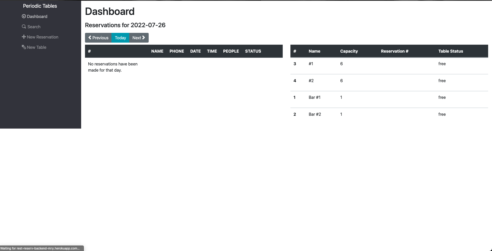
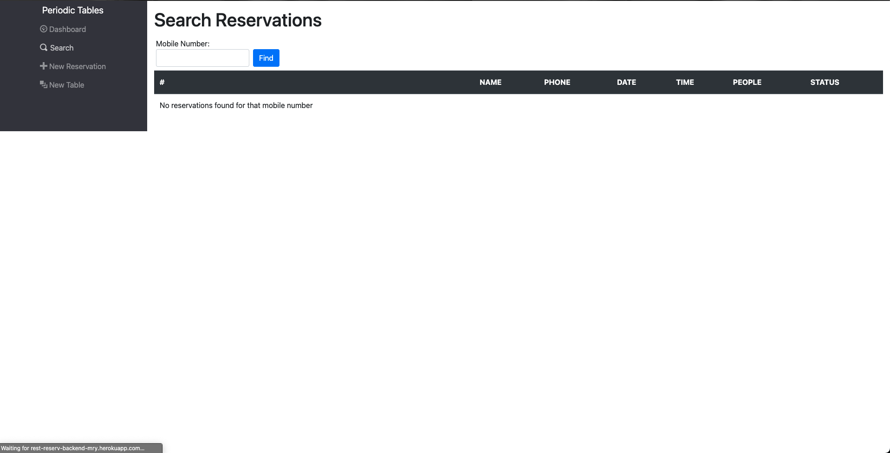
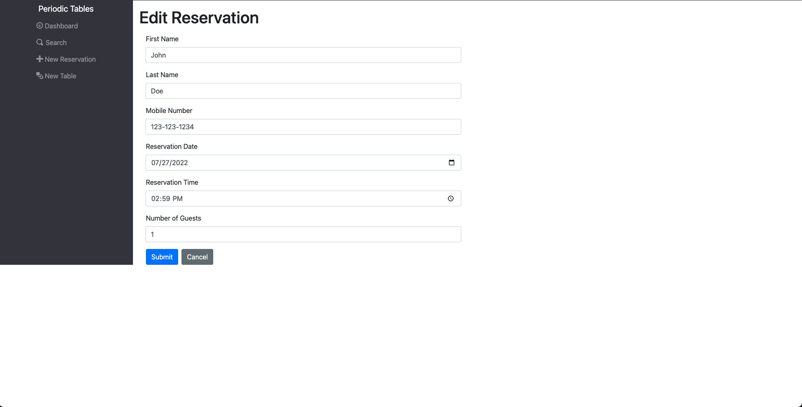
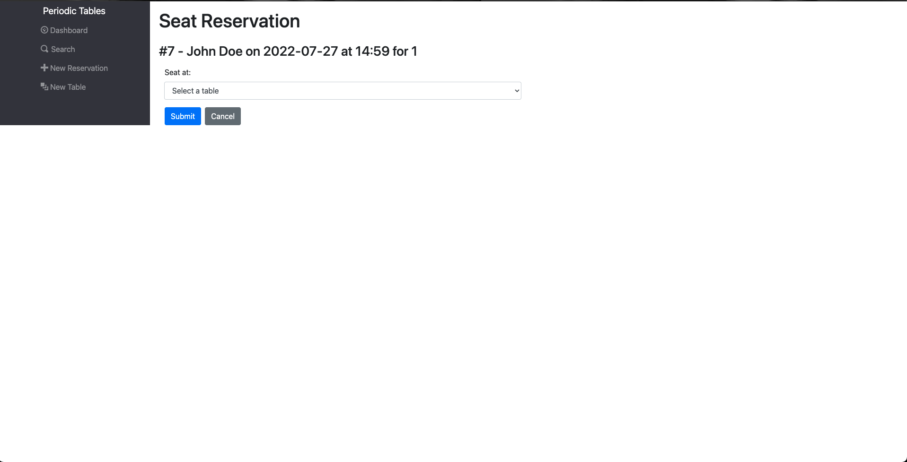
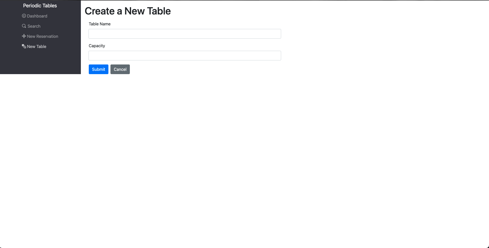

# Capstone: Restaurant Reservation System
This application will allow restaurant staff to keep track of customer reservations and seating. The application allows staff to create, search, edit, seat, and cancel reservations. The application will also keep track of reservations that have been finished after being seated. 

Prompt for project: 
> You have been hired as a full stack developer at _Periodic Tables_, a startup that is creating a reservation system for fine dining restaurants.
> The software is used only by restaurant personnel when a customer calls to request a reservation.
> At this point, the customers will not access the system online.

##Live Links

[Deployed Application](https://rest-reserv-frontend-mry.herokuapp.com/dashboard)

[Deployed Backend (API)](https://rest-reserv-backend-mry.herokuapp.com/)

##Screenshots

###Dashboard

The dashboard (/dashboard) has these features: 
- List all reservations for a date (default is the currentt date), sorted by time of reservation
	- Shows reservation status
	- Buttons to allow seating, editing, and cancelling the reservation
- List all tables, sorted by name
	- Shows tables status (occupied or free)
	- Button to finish table when occupied by reservation
- Buttons for user to switch days, both in the future and in the past
- Error messages from the API will appear above tables when present

###Search for a Reservation

The search page (/search) has these features:
- Allows user to search for reservations with mobile number
- Reservations found with the search parameter will display sorted by time
- Listed reservations will show status and have buttons to allow for seating, editing, and cancelling reservation

###Create a Reservation

The new reservation page (/reservations/new) has these features:
- Form for creating a new reservation
	- All fields are required
	- Errors will appear above the form when trying to book on wrong date or at wrong time
- Submitting the form wil return the user to the dashboard for the date of the new reservation
- Cancelling the form will bring the user back to the previous page

###Edit a Reservation

The edit reservation page (/reservations/{reservation_id}/edit) has these features:
- Form that allows user to edit a reservation
- Submitting the form wil return the user to the dashboard for the date of the edited reservation
- Cancelling the form will bring the user back to the previous page

###Seat a Reservation

The seat reservation page (/reservations/{reservation_id}/seat) has these features:
- Select options for which table to seat the reservation at
	- Errors will appear above the options if the seating assignment is not allowed
- Submitting the seating form will bring the user to the dashboard for that date
	- Tables will show the reservation seated at the chosen table
- Cancelling the form will bring the user back to the previous page

###Create a Table

The new table page (/tables/new) has these features: 
- Form that allows the user to create a new table
	- Errors will appear above the form if present
- Submitting the form will bring the user to the dashboard and display the newly created table in the list of tables
- Cancelling the form will bring the user back to the previous page

##Technology

This application was built with the following:
- React.js
- Bootstrap
- Knex
- Express
- Heroku
- HTML
- CSS
- PostgreSQL

## Installation

1. Fork and clone this repository.
2. Run `cp ./back-end/.env.sample ./back-end/.env`.
3. Update the `./back-end/.env` file with the connection URL's to your ElephantSQL database instance.
4. Run `cp ./front-end/.env.sample ./front-end/.env`.
5. You should not need to make changes to the `./front-end/.env` file unless you want to connect to a backend at a location other than `http://localhost:5001`.
6. Run `npm install` to install project dependencies.
7. Run `npm run start:dev` to start your server in development mode.

### Knex

Run `npx knex` commands from within the `back-end` folder, which is where the `knexfile.js` file is located.
